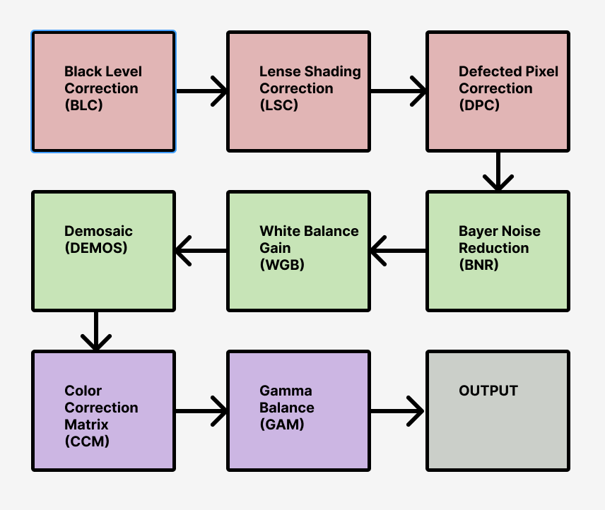
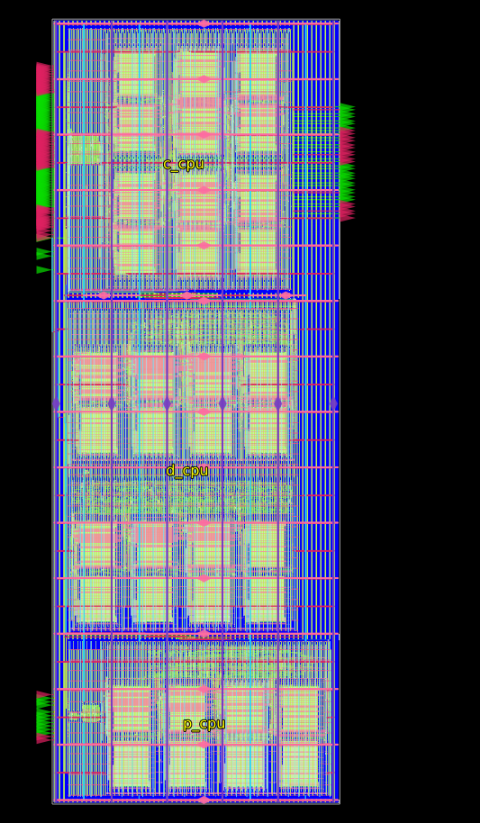
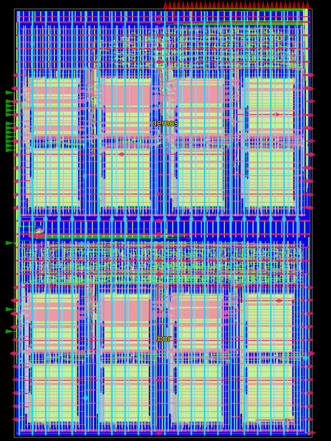
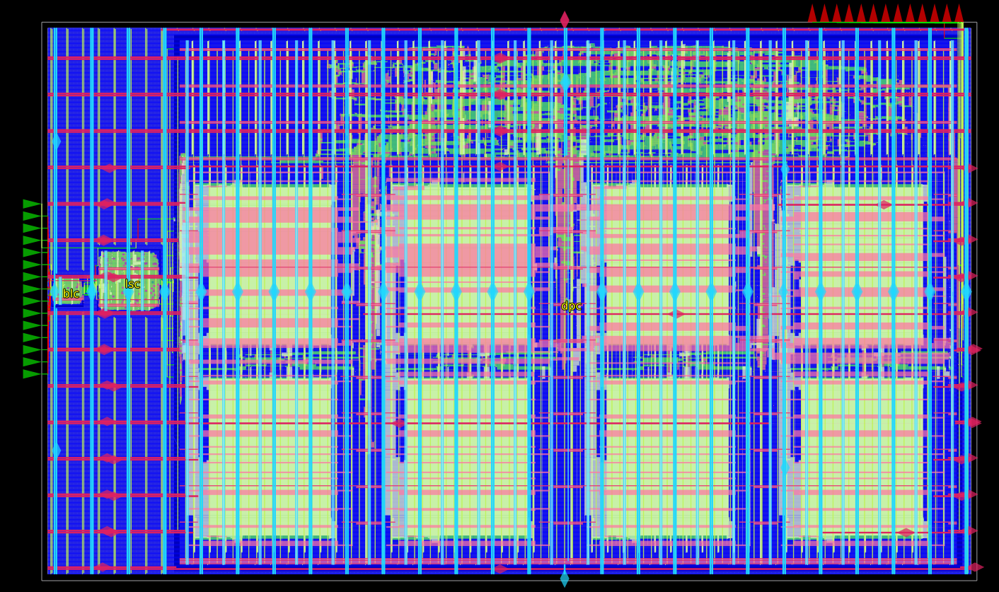
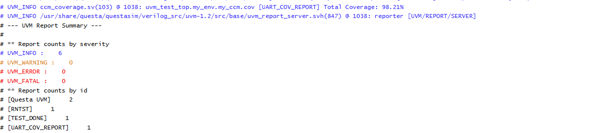
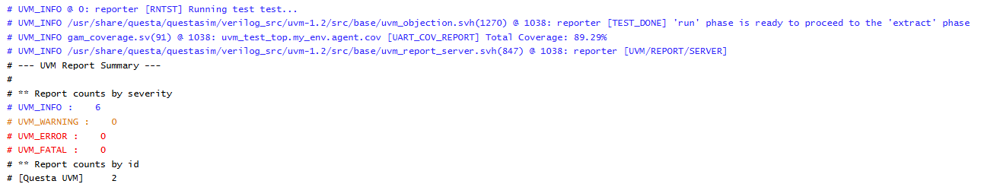
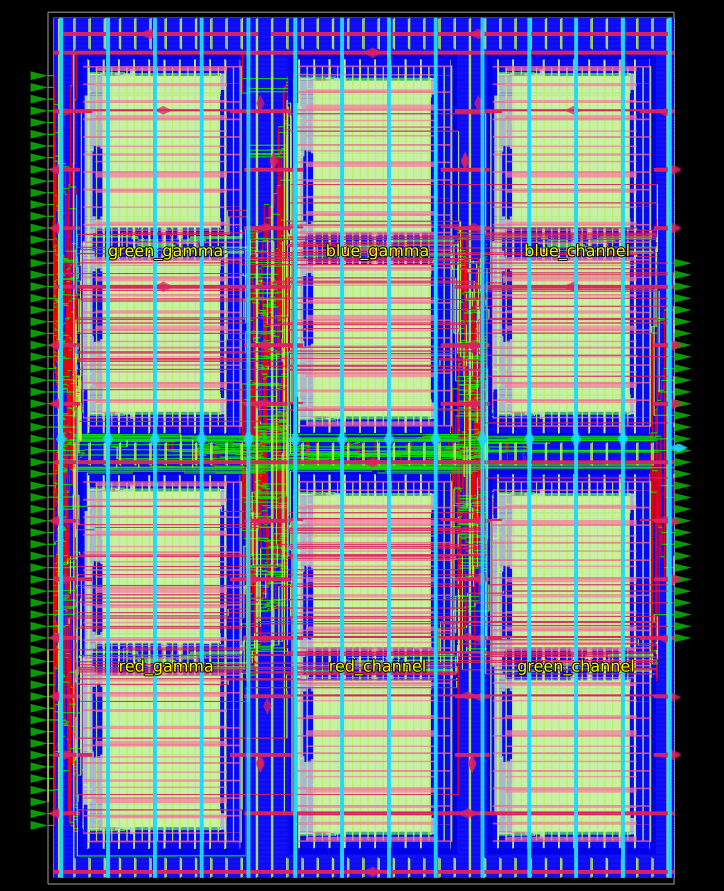

# Useful References
* [Visual Computing ISP Guide](https://learnvisualcomputing.github.io/imaging-isp.html)
* [Stanford Imaging & ISP Architecture (Hegarty)](https://cs.stanford.edu/~zdevito/a144-hegarty.pdf)
* [Espressif ESP32-P4 ISP Peripheral API](https://docs.espressif.com/projects/esp-idf/en/stable/esp32p4/api-reference/peripherals/isp.html)
* [Xilinx ISP User Guide](https://www.xilinx.com/publications/user-guide/isp-user-guide.pdf)
* [10xEngineers Infinite-ISP Guide](https://10xengineers.ai/exploring-the-world-of-infinite-isp-a-guide-to-infinite-possibilities/)

# Project Overview
This repository contains a high-performance Image Signal Processor (ISP) core designed for System-on-Chip (SoC) integration. The core ingests 10-bit raw pixel data from a camera sensor via burst transactions to feed a high-throughput downstream FIFO pipeline. Engineered to target a resolution of 2K (2048×1080) at 60 FPS, the system is synthesized and physically implemented using the Nangate45 Process Design Kit (PDK).

## Pipeline Architecture

## Performance Targets & Timing Budget
To support the 2048×1080 target resolution at 60 FPS, the system is engineered to process 132,710,400 pixels/sec.
* **Row Budget:** Frame timing constraints equate to a strict **15.43 µs per row** calculation: `(1 / 60) / 1080 = 15.43 µs`.
* **Clock Frequency:** Accounting for burst transaction speeds, data packing, and potential downstream pipeline blocking, the required base clock of 300 MHz is elevated to **333.33 MHz (3.0 ns period)** to build operational margin.
* **Latency Margin:** At 333.33 MHz, processing a single row consumes **6.14 µs** (`2048 / 333.33 MHz = 6.14 µs`), leaving a comfortable **9.29 µs processing overhead** per row within the line budget.

## Implementation Methodology & Optimization Tactics
* **Submodule Over-Constraining:** Submodules were synthesized and constrained to an aggressive 2.5 ns clock period (400 MHz) to guarantee ample timing headroom when instantiated at the top level.
* **Domain Partitioning:** Partitioned the physical design into three domain-specific processing engines (Physical, Digital, and Color CPUs) to isolate critical paths and streamline timing closure.
* **Arithmetic Efficiency:** Implemented standard ISP line blanking, sliding-window line buffers, and shift-based hardware math approximations (left/right bit shifts) to eliminate expensive hardware dividers.
* **Timing Closure Optimization:** Resolved setup and hold violations using selective multi-VT mapping, aggressive pipelining, driver resizing, fan-out restructuring, manual module proximity adjustments, and targeted buffer insertion.

## Challenges & Solutions
* **Top-Level Setup Timing Closure:** Initial top-level flat synthesis created major setup timing violations due to extensive routing and logic depth.
  * *Solution:* Implemented a modular hierarchical hierarchy. Partitioned the core logic into sub-engines (`P_CPU`, `D_CPU`, `C_CPU`), turning the top level into a clean interconnect layer. By over-constraining the sub-blocks to 2.5 ns, standard cell placement was precisely controlled and top-level timing closed cleanly at 3.0 ns. Additionally an added pipeline stage was positioned between the `P_CPU` and `D_CPU` as a high capicative load and skew appeared between cores.

## Physical Implementation Results
* **Core Area:** 1660 µm × 4530 µm
* **Target Core Density:** 82% core utilization
* **Timing Sign-Off:** Successfully closed timing at 333.33 MHz with **0.487 ns setup slack** and **0.00 ns hold slack**.

# ISP Top-Level Architecture
The top-level ISP core is hierarchically organized into three specialized execution engines based on the three primary stages of image signal processing: Physical CPU (`P_CPU`), Digital CPU (`D_CPU`), and Color CPU (`C_CPU`).

### Physical CPU (`P_CPU`)
Handles front-end hardware and sensor-level artifact remediation, including Black Level Correction (BLC), Lens Shading Correction (LSC), and Defective Pixel Correction (DPC).
* **Die Dimensions & Area:** 1540 µm × 1920 µm
* **Core Utilization:** 66% core density
* **Timing Sign-Off:** +0.57 ns setup slack | 0.00 ns hold slack

### Digital CPU (`D_CPU`)
Processes spatial noise, digital artifacts, and raw Bayer pattern reconstruction, comprising Bayer Noise Reduction (BNR), White Balance Gain (WBG), and Malvar-He-Cutler Demosaicing (DEMOS).
* **Die Dimensions & Area:** 1350 µm × 1940 µm
* **Core Utilization:** 73% core density
* **Timing Sign-Off:** +0.10 ns setup slack | 0.00 ns hold slack

### Color CPU (`C_CPU`)
Performs full RGB color space transformation and perceptual balance, incorporating the 3×3 Color Correction Matrix (CCM) and SRAM LUT-based Gamma Correction (GAM).
* **Die Dimensions & Area:** 1310 µm × 1540 µm
* **Core Utilization:** 83% core density
* **Timing Sign-Off:** +0.64 ns setup slack | 0.00 ns hold slack

# Submodules
## FIFO Buffer

### Overview
The FIFO module serves as a synchronized buffer for the 10-bit pixel data coming off the token bus. Because this logic will be integrated directly into the top-level module of the ISP chip, standard physical implementation steps (Synthesis, PnR, and GLS) are bypassed at this individual module level.

### Architecture & Hardware Design

### Synchronous FIFO (`fifo.v`)
This module is a parameterized synchronous FIFO, sized by default to a data width of 10 (`DATA_W = 10`) and a depth of 8 (`FIFO_D = 8`). 
* **Memory Inference:** Given the shallow depth, the memory is inferred as a simple register array rather than a hardened memory macro.

* **Pointer Management:** The design utilizes a standard binary read/write pointer scheme. An extra MSB guard bit is implemented to easily distinguish between `FULL` and `EMPTY` states without requiring gray-code conversion. This is perfectly safe as both pointers operate on the same clock domain without CDC concerns.

* **Stall-Free Operation:** Reads and writes are internally gated by `!EMPTY` and `!FULL` conditions. Back-to-back invalid operations are safely ignored, eliminating the need for complex external stall logic.

### Verification Environment
Validation for the FIFO bypasses a heavy UVM environment, as the required operational states are relatively simple. A basic static testbench was utilized to successfully verify:
* Read/Write operations on an empty buffer.
* Read/Write operations on a full buffer.
* Intermediate concurrent read and write operations.

## Black Level Correction (BLC)

### Overview
The Black Level Correction (BLC) stage is responsible for removing the camera sensor's innate black level offset and rescaling the resulting pixel values back to the full dynamic range. The correction follows the mathematical relationship: `(pixel - offset) * (2^n) / (sat_level - offset)`. 

Because the sensor offset and headroom differ across the Bayer filter color channels, the module dynamically tracks the row and column toggle (driven by `h_sync` and `v_sync`) to identify the currently active channel (R, Gr, Gb, or B).

### Architecture & Hardware Design

#### BLC Pipeline (`BLC.v`)
The module processes the pixel stream through a highly optimized, 2-stage deep pipeline (`DELAY = 2`) that aligns the offset subtraction, multiplication, and clamping stages with the passing `valid`, `h_sync`, and `v_sync` control signals.
* **Elaboration-Time Scaling:** To avoid costly runtime hardware dividers, the scaling factors for each channel are precomputed at elaboration time. These are mapped as local parameters using a 16-bit fixed-point representation (`FRAC_BITS = 16`).

* **Dynamic Channel Muxing:** The active channel's specific `OFFSET_*` and precomputed `SCALE_FACTOR_*` are cleanly multiplexed into the datapath based on the real-time row/col position.

* **Safe Clamping Logic:** * **Underflow:** If a pixel value falls below the channel's specific black level during subtraction, the output is strictly clamped to `0`.
    * **Overflow:** If the rescaled value exceeds the maximum pixel range (`MAX_VAL`), it is clamped to full scale. This ensures the output never wraps, maintaining image integrity regardless of incoming black level noise.

### UVM
The design is validated within a UVM environment using purely randomized sequences of pixel streams and stalling behaviors to accurately replicate real-world camera sensor data. 

**EDA Playground Link:** [Launch UVM Simulation](https://edaplayground.com/x/7cP_)

* **Functional Coverage:** The environment utilizes a dedicated subscriber (`blc_coverage.sv`) to ensure robust test stimulus.It verifies that all four Bayer color channels (R, Gr, Gb, B) are fully exercised via row and column phase cross-coverage. It also ensures the full range of 10-bit input and output pixel values are generated , alongside comprehensive checking of control signal permutations (`h_sync`, `v_sync`, and `valid`).

* **Predictive Scoreboard:** The scoreboard (`scoreboard.sv`) implements an expected queue model (`exp_que`). When the monitor samples a valid input signal, the scoreboard independently calculates the expected output—applying the correct offset and scaling math based on the active color channel—and pushes it to the queue. Upon receiving a valid output from the DUT, the expected value is popped and directly compared against the actual `pixel_out`, flagging a `UVM_ERROR` upon any mismatch.

## Lens Shading Correction (LSC)

### Overview
The Lens Shading Correction (LSC) module compensates for the optical vignetting inherent to camera lenses, where image brightness naturally falls off towards the corners. The module applies a spatially-dependent digital gain to the incoming pixel stream, effectively brightening the periphery to achieve uniform illumination. 

The correction relies on a simplified radial polynomial equation: `pixel_out = pixel_in * Gain`. 
The `Gain` is calculated as `1 + c2 * R^2`, where `R^2` is the squared distance from the optical center (`dx^2 + dy^2`). The architecture assumes a standard RGGB raw Bayer pattern, allowing for distinct spatial correction coefficients (`c2`) for each color channel.

### Architecture & Hardware Design

#### Spatial Pipelining (`LSC.v`)
To meet timing requirements while performing complex spatial mathematics, the module is constructed as a 6-stage deep pipeline (`DELAY = 6`). 

* **Coordinate Tracking:** The module actively tracks the current `x_count` and `y_count` of the incoming pixel stream, resetting upon `v_sync` and incrementing through the frame dimensions. 

* **Fixed-Point Datapath:** To avoid floating-point operations in hardware, the module utilizes a 24-bit fractional shift (`FP_SHIFT = 24`). It calculates the absolute distance from the frame center (`MID_X`, `MID_Y`), squares the results, and applies the channel-specific coefficient to calculate the required gain.

* **Overflow Protection:** After multiplying the input pixel by the computed spatial gain, the shifted result is aggressively clamped. If the brightened pixel exceeds the 10-bit maximum, it is locked to `MAX_VAL` to prevent numerical wrapping artifacts.

### UVM Verification Environment
The LSC module is rigorously validated using the established UVM environment, focusing on spatial accuracy and boundary conditions.

**EDA Playground Link:** [Launch UVM Simulation](https://edaplayground.com/x/FgsN)

* **Functional Coverage:** The `lsc_coverage` subscriber confirms that the internal tracking logic successfully sweeps across the entire target frame. It maps cross-coverage for X and Y coordinates to guarantee all quadrants of the image are stimulated, alongside standard signal toggling and full 10-bit data range utilization.

* **Predictive Scoreboard:** The scoreboard actively recalculates the required spatial math in SystemVerilog to verify the RTL. Upon sampling a valid input, the scoreboard independently derives `dx`, `dy`, and `R^2`, applies the corresponding 24-bit fixed-point math, and pushes the clamped expected result into a queue (`exp_que`). When the DUT asserts `valid_out`, this queue is popped and compared to ensure strict mathematical accuracy.

## Defective Pixel Correction (DPC)

### Overview
The Defective Pixel Correction (DPC) module is designed to identify and repair "hot" or "dead" pixels generated by sensor anomalies. It achieves this by employing a 5x5 sliding window algorithm to evaluate the 8 nearest neighboring pixels of the same color channel. If the center pixel deviates beyond a defined `THRESHOLD` compared to its neighbors, it is replaced by their average value. The module is designed with a 2-row blanking awareness and only corrects internal cells, leaving the extreme outer edges unmodified.

#### Architecture & Hardware Design

##### Memory and Buffering (`DPC.v`)
To facilitate a 5x5 spatial window, the module requires access to multiple rows of video simultaneously. 
**SRAM Line Buffers:** The top-level module instantiates four distinct 10x2048 SRAM blocks (`sram0` through `sram3`). These act as FIFO line buffers, cascading the incoming pixel stream to construct the vertical depth needed for the algorithm.

##### Correction Core (`DPC_CORE.v`)
The core processing logic handles the mathematical defect detection and substitution.
**Spatial Tracking:** The core actively tracks the X and Y coordinates to determine if the current pixel is on a frame edge (`is_edge`) or if it is a green channel pixel (`is_green`) based on the Bayer pattern.

* **Min/Max Detection:** It continuously calculates the maximum (`neigh_max1`) and minimum (`neigh_min1`) values among the 8 surrounding neighbors.

* **Defect Substitution:** A pixel is flagged as `is_hot` if it is greater than the neighbor maximum by the `THRESHOLD`. It is flagged as `is_dead` if it is less than the neighbor minimum by the `THRESHOLD`. Defective pixels are immediately replaced by the local neighborhood average (`neigh_total`); otherwise, the original pixel is passed through.

#### UVM Verification Environment
The DPC logic is thoroughly verified to ensure edge cases in the image boundary and varying color channels do not break the 5x5 spatial mapping.

**EDA Playground Link:** [Launch UVM Simulation](https://edaplayground.com/x/Eqfs)

* **Functional Coverage:** The `dpc_coverage` subscriber targets explicit cross-coverage scenarios. It ensures that hot and dead pixel conditions are verified against both Green and non-Green (Red/Blue) channels.It also guarantees these defect corrections are tested at the frame edges (`is_edge`) versus the center.

* **Predictive Scoreboard:** The scoreboard builds a 2D reference image (`ref_image`) in memory as data flows in. It implements the expected DPC logic in software, dynamically adjusting which 8 neighbors to sample based on whether the current coordinate aligns with a green pixel in the Bayer pattern. It calculates the threshold math independently and compares the resulting expected value against the DUT's `pixel_out`, flagging a `UVM_ERROR` upon any discrepancy.

### Logic Synthesis & Static Timing Analysis (STA)
Logic synthesis and static timing analysis (STA) were executed using Yosys and OpenSTA across three distinct operating corners: `slow` (worst-case), `typ`, and `fast`. The target technology mapping utilized the nanGate45 standard cell library alongside custom 10x2048 SRAM macro libraries. The synthesis targeted a strict 3ns clock period (333.33 MHz).

* **Capacitance & Slew Violations:** During the synthesis phase, the ABC optimization pass failed to properly buffer several high-fanout nets. OpenSTA flagged these as severe maximum capacitance (`max_capacitance`) violations, which consequently cascaded into maximum slew (`max_slew`) failures.

* **Worst-Case Timing:** As a direct result of the high capacitance and degraded slew on these unbuffered nets, the static timing analysis reported setup failures under the `slow` worst-case corner. 

* **Waiver & Resolution:** Because Yosys relies on ideal clock networks and basic wire load assumptions, these synthesis-stage violations were waived. The physical design (PNR) tool's superior CTS (Clock Tree Synthesis) and routing engines successfully rebuilt the data paths, buffered the high-fanout nets, and resolved all capacitance, slew, and setup/hold timing issues for final sign-off.

### Physical Design (PNR)
The physical implementation flow was executed using OpenROAD, advancing the synthesized netlist through floorplanning, placement, clock tree synthesis (CTS), and detailed routing. The final layout targets a fixed die size of 1050µm × 1720µm utilizing the nanGate45 Open Cell Library and four custom OpenRAM SRAM macro configurations.

* **Floorplanning & Power Distribution:** The design incorporates an extensive power distribution network (PDN) utilizing `metal1` for standard cell rows, `metal4` for intermediate horizontal stripes, and wide `metal5`/`metal6` grids for low-impedance vertical infrastructure. Custom SRAM halos and grid mappings were applied to ensure clean power delivery to the memory blocks.

* **Placement & Congestion Control:** To prevent cell crowding around the memory interfaces and routing bottlenecks during detailed routing, cell placement padding was globally constrained using `set_placement_padding -global -left 5 -right 5`. Small, low-drive buffer and inverter variants (`*BUF_X1`, `*BUF_X2`, `*INV_X1`, `*INV_X2`) were set as `dont_use` to force the tool to instantiate robust, transition-resilient logic across long interconnects.

* **Clock Tree Synthesis (CTS):** Clock networks were synthesized using a specific buffer target list bounded to high-drive variants (`CLKBUF_X3`). Implementing propagated clocking and automatic net repairs effectively resolved the severe setup failures and maximum capacitance/slew violations carried over from the logic synthesis phase.

* **Routing & Sign-off:** Signal routing was constrained to layers `metal2` through `metal6`, leaving `metal1` dedicated exclusively to cell local connections, while clock trees were assigned to higher-speed `metal3` through `metal6` layers. Antenna violations were automatically checked and mitigated via intermediate diode insertion (`repair_antennas`). 

* **Physical & Electrical Metrics:** The completed layout achieved full sign-off closure with **0 DRC, 0 LVS, and 0 ERC errors**. 
  * **Area Utilization:** `75%` target core density across the 1050µm × 1720µm die boundary.
  * **Timing Sign-off:** Successfully closed timing with a positive setup slack margin of `0.31ns`.
  * **Power Consumption:** Total power consumption closed at `6.17mW` (`6.17e-03 Watts`), with an electrical distribution profile of `46%` internal power, `51%` dynamic switching power, and a well-controlled `3%` static leakage component.

## Bayer Noise Reduction (BNR)

### Overview
The Bayer Noise Reduction (BNR) module filters out high-frequency noise inherent to camera sensors by utilizing a 5x5 sliding window. It calculates a normalized, weighted average of neighboring pixels by evaluating both their spatial proximity and their intensity difference (range) relative to the center pixel. The algorithm selectively smooths areas of uniform color while preserving sharp edges.

### Architecture & Hardware Design

#### Memory Buffering (`BNR.v`)
To support the complex 5x5 spatial window, the module requires concurrent access to multiple video lines. 
**SRAM Line Buffers:** The architecture integrates four separate 10x2048 SRAM macros (`sram0` through `sram3`). These act as cascading FIFO buffers to retain the necessary historical row data as the pixel stream flows in.

#### Processing Core (`BNR_CORE.v` & `RANGE_LUT.v`)
To meet strict timing budgets while calculating multi-variable weighted averages, the mathematical core is aggressively pipelined across 10 stages (`DELAY = 10`).

* **Bayer-Aware Spatial Weighting:** The module evaluates the X/Y coordinates to determine if the center pixel lies on a Green channel or a Red/Blue channel (`is_green`). It then dynamically applies the correct spatial weight distribution to match the underlying Bayer filter pattern.

* **Range LUT:** Absolute intensity differences between the center and neighboring pixels are fed into a Look-Up Table (`RANGE_LUT.v`). Smaller differences receive higher weights (e.g., a difference <= 15 yields a weight of 4), ensuring that only visually similar pixels contribute heavily to the noise reduction.

* **ROM-Based Normalization:** To divide the final accumulated value by the sum of all applied weights, the design avoids instantiating an expensive hardware divider. Instead, it utilizes a reciprocal ROM containing pre-computed values (`1024 / r`). The final normalization is efficiently executed as a multiplication against the reciprocal, followed by a 10-bit right shift.

* **Edge Bypass:** Pixels residing on the extreme outer boundary of the frame (`is_edge`) bypass the filtering logic and are output unmodified.

### UVM Verification Environment
The BNR module's complex weighting math and boundary conditions are rigorously tested using a UVM framework.

**EDA Playground Link:** [Launch UVM Simulation](https://edaplayground.com/x/9pNZ)

* **Functional Coverage:** The `bnr_coverage` subscriber maps the full 10-bit input/output pixel range. It tracks memory coordinates to ensure the entire frame is swept and verifies cross-coverage for critical edge conditions (`is_edge`) and color channel variations (`is_green`).

* **Predictive Scoreboard:** The scoreboard models the complete algorithm in SystemVerilog. It builds a 2D reference image in memory and independently computes the expected range weights, spatial mapping, and reciprocal normalization. This expected value is then rigorously compared against the DUT's `pixel_out`, throwing a `UVM_ERROR` upon any mismatch.

### Logic Synthesis & Static Timing Analysis (STA)
Logic synthesis and static timing analysis (STA) for the BNR module were executed using Yosys and OpenSTA across three distinct operating corners: `slow` (worst-case), `typ`, and `fast`. The target technology mapping utilized the nanGate45 standard cell library alongside custom 10x2048 SRAM macro libraries. The synthesis targeted a strict 3ns clock period (333.33 MHz) via ABC constraints.

* **Capacitance & Slew Violations:** Similar to the DPC module, during the synthesis phase, the optimization pass failed to properly buffer several high-fanout nets. OpenSTA flagged these as severe maximum capacitance (`max_capacitance`) violations, which consequently cascaded into maximum slew (`max_slew`) failures.
* **Worst-Case Timing:** As a direct result of the high capacitance and degraded slew on these unbuffered nets, the static timing analysis reported setup failures under the `slow` worst-case corner. 
* **Waiver & Resolution:** Because Yosys relies on ideal clock networks and basic wire load assumptions, these synthesis-stage violations were waived. The physical design (PNR) tool's superior CTS (Clock Tree Synthesis) and routing engines successfully rebuilt the data paths, buffered the high-fanout nets, and resolved all capacitance, slew, and setup timing issues for final sign-off.

### Physical Design (PNR)
The physical implementation flow was executed using OpenROAD, advancing the synthesized netlist through floorplanning, placement, clock tree synthesis (CTS), and detailed routing. The final layout targets a fixed die size of 1150µm × 1820µm utilizing the nanGate45 standard cell library and four custom OpenRAM SRAM macro configurations.

* **Floorplanning & Power Distribution:** The design incorporates an extensive power distribution network (PDN) utilizing `metal1` for standard cell rows, `metal4` for intermediate horizontal stripes, and wide `metal5`/`metal6` grids for low-impedance vertical infrastructure. Custom SRAM halos (`-halo {1 1 1 1}`) and grid mappings were applied to ensure clean power delivery to the memory blocks.

* **Placement & Congestion Control:** To prevent cell crowding around the memory interfaces and routing bottlenecks during detailed routing, cell placement padding was globally constrained using `set_placement_padding -global -left 5 -right 5`. 

* **Clock Tree Synthesis (CTS):** Clock networks were synthesized using a specific buffer target list bounded to high-drive variants (`CLKBUF_X3`). Implementing propagated clocking and automatic net repairs effectively resolved the severe setup failures and maximum capacitance/slew violations carried over from the logic synthesis phase.

* **Routing & Sign-off:** Signal routing was constrained to layers `metal2` through `metal6`, leaving `metal1` dedicated exclusively to cell local connections. Clock trees were assigned to higher-speed `metal3` through `metal6` layers. Antenna violations were automatically checked and mitigated via intermediate diode insertion (`repair_antennas`). 

* **Physical & Electrical Metrics:** The completed layout achieved full sign-off closure, successfully clearing the setup and design rule violations from synthesis to yield a timing-clean, fully routed module ready for top-level integration.
  * **Area Utilization:** Achieved `70%` target core density across the 1100µm × 1800µm die boundary.
  * **Timing Sign-off:** Successfully closed timing with a positive setup slack margin of `0.21ns`.
  * **Power Consumption:** Total power consumption closed at `5.63mW`, with an electrical distribution profile of `68.9%` internal power, `26.7%` dynamic switching power, and a well-controlled `4.4%` static leakage component.

## White Balance Gain (WBG)

### Overview
The White Balance Gain (WBG) stage adjusts the relative color intensities of the Bayer filter grid to ensure that neutral colors are accurately reproduced under varying ambient lighting conditions. By applying independent, digital gains to each specific color channel (R, Gr, Gb, and B), the module compensates for illumination imbalances introduced by the capture environment or inherent camera sensor sensitivities. 

The correction relies on a fixed-point multiplication datapath: `pixel_out = (pixel_in * GAIN) >> FRAC_BITS`. The active gain configuration is dynamically multiplexed into the execution pipeline based on the real-time row and column synchronization state of the raw image stream.

### Architecture & Hardware Design

#### WBG Pipeline (`WBG.v`)
The module streams pixel data through a highly synchronized, single-stage execution pipeline (`DELAY = 1`) that precisely aligns data transformations with passing control indicators.
* **Bayer Phase Tracking:** The architecture implements local monitoring registers (`row`, `col`) that track line and frame transitions by checking the `v_sync` and `h_sync` boundaries. This coordinate tracking uniquely identifies the current color channel phase for every incoming pixel.
* **Fixed-Point Gain Application:** The core computes scaling math using an 8-bit fractional shift parameter (`FRAC_BITS = 8`). Based on the determined Bayer quadrant, the incoming pixel is multiplied by corresponding programmable channel coefficients: `R_GAIN = 384`, `GR_GAIN = 256`, `GB_GAIN = 256`, or `B_GAIN = 512`.
* **Control Pipelining:** To guarantee timing closure under high frequency operation, control qualifiers (`valid_in`, `h_sync`, `v_sync`) are registered and advanced through parallel matching pipelines (`valid_pipe`, `h_pipe`, `v_pipe`) to emerge perfectly aligned with the processed pixel output.
* **Overflow Dynamic Clamping:** Following the fixed-point right-shift operation, the product is evaluated against a 10-bit maximum headroom limit (`MAX_VAL`). If the scaled pixel exceeds the top boundary, the output is bounded to full scale to avoid structural wrapping artifacts and protect image clarity.

### UVM Verification Environment
The mathematical accuracy and coordinate tracking logic of the WBG module are thoroughly validated using a comprehensive UVM testbench.

**EDA Playground Link:** [Launch UVM Simulation](https://edaplayground.com/x/Jc8Z)

* **Functional Coverage:** The `wbg_coverage` subscriber validates test suite stimulus via an internal covergroup configuration. It partitions the full 10-bit input and output data ranges into 10 distinct distribution bins to ensure complete dynamic range sweep. Additionally, it maps explicit cross-coverage across the even/odd variations of `row_phase` and `col_phase` to guarantee all four Bayer color domains (R, Gr, Gb, B) are fully exercised, alongside detailed testing of control signal combinations (`valid_out`, `h_sync_out`, `v_sync_out`).

* **Predictive Scoreboard:** The scoreboard component models the golden architectural specification in software using an internal storage array (`exp_que`). When valid input data is captured, the scoreboard independently decodes the current Bayer grid phase, matches the appropriate hardware multiplier coefficient, shifts the fixed-point value, and logs the clamped result. Output items arriving from the DUT are instantly popped and checked for bit-accurate numerical parity, automatically generating a `UVM_ERROR` upon any data mismatch or out-of-order execution error.

## Demosaic (DEMOS)

### Overview
The Demosaic (DEMOS) module is responsible for reconstructing a full-color RGB image from the single-channel Bayer pattern captured by the sensor. The design implements the High-Quality Linear Interpolation algorithm, commonly known as the Malvar-He-Cutler (MHC) approach. By evaluating a 5x5 spatial window, the algorithm calculates sharp, artifact-free color interpolations by factoring in the high-frequency luminance data (usually the Green channel) to correct the Red and Blue channel estimations.

### Architecture & Hardware Design

#### Memory and Buffering (`DEMOSAIC.v`)
To facilitate the necessary 5x5 spatial window for the MHC algorithm, the module must simultaneously access 5 lines of video data.
* **SRAM Line Buffers:** The top-level module instantiates four distinct 10x2048 SRAM blocks (`sram0` through `sram3`). These act as synchronized FIFO line buffers, cascading the incoming 10-bit pixel stream to construct the required vertical depth.

#### MHC Processing Core (`DEMOS_CORE.v`)
To compute the complex cross, diagonal, and linear summations required by the MHC algorithm without violating timing, the mathematical core is aggressively pipelined across 4 stages (`DELAY = 4`).
* **Bayer Phase Tracking:** The core actively tracks the underlying X and Y coordinates to determine the phase of the 5x5 window's center pixel (`2'b00` for Red center, `2'b01`/`2'b10` for Green centers, and `2'b11` for Blue center). This dictates exactly which interpolation equations are routed to the final RGB output ports.
* **Hardware-Optimized Interpolation:** The core evaluates directional sums (cross, diagonal, vertical/horizontal inner/outer) and computes the necessary gradients. To avoid instantiating costly hardware dividers, the final normalization steps utilize fixed-point right shifts (e.g., `>>> 3` for division by 8, and `>>> 4` for division by 16).
* **Edge Handling:** To prevent visual artifacts at the extreme boundaries of the image frame, the module implements dynamic edge padding logic, intelligently repeating boundary pixels into the `calc_window` when the coordinate pipeline detects a frame edge.
* **Dynamic Clamping:** Following interpolation, the resulting color values are aggressively clamped. Any mathematically underflowed values are locked to `0`, and any overflowed values are locked to the 10-bit maximum (`MAX_VAL`) to maintain data integrity.

### UVM Verification Environment
The DEMOS module's mathematical model and boundary handling are thoroughly validated using a comprehensive UVM framework.

**EDA Playground Link:** [Launch UVM Simulation](https://edaplayground.com/x/c7bt)

* **Functional Coverage:** The testbench utilizes a dedicated `demos_coverage` subscriber to validate the simulation stimulus. An internal covergroup successfully maps the 10-bit input (`pixel_in`) and the resulting RGB outputs (`red_out`, `green_out`, `blue_out`) across 10 distinct distribution bins to verify the full dynamic range. It also tracks explicit cross-coverage for the output control signals (`valid_out`, `h_sync_out`, `v_sync_out`). To replicate real-world sensor behavior, the driving sequence (`demos_base_seq`) actively injects stalls by dropping the `valid_in` signal on alternating rows.
* **Predictive Scoreboard:** The `scoreboard` component fully models the MHC algorithm in software. As data flows in, it constructs a complete 2D reference image (`ref_image`) in memory. The scoreboard dynamically mirrors boundary pixels to safely build a 5x5 spatial window at the frame edges. It independently computes the necessary inner, outer, diagonal, and cross sums, scales the results via bit-shifts, and clamps the expected values to `MAX_VAL`. Upon capturing an output packet from the DUT, the scoreboard directly compares its derived math against the packet's hardware-generated RGB values, instantly throwing a `UVM_ERROR` (`"SCBD_MISMATCH"`) if any mathematical deviation is detected.

### Logic Synthesis & Static Timing Analysis (STA)
Logic synthesis and static timing analysis (STA) were executed using Yosys and OpenSTA across three distinct operating corners: `slow` (worst-case), `typ`, and `fast`. The target technology mapping utilized the nanGate45 standard cell library alongside custom 10x2048 SRAM macro libraries. The logic synthesis targeted a strict 3ns clock period (333.33 MHz) via ABC constraints (`-D 3000`).

* **Capacitance & Slew Violations:** Similar to other modules in the pipeline, the synthesis optimization pass failed to properly buffer several high-fanout nets. OpenSTA flagged these as severe maximum capacitance (`max_capacitance`) and maximum fanout (`max_fanout`) violations, which consequently cascaded into maximum slew (`max_slew`) failures.

* **Worst-Case Timing:** As a direct result of the high capacitance and degraded slew on these unbuffered nets, the static timing analysis reported maximum path delay (setup) failures under the worst-case operating corners. 
* **Waiver & Resolution:** Because Yosys relies on ideal clock networks and basic wire load assumptions, these synthesis-stage violations were waived. The physical design (PNR) tool's superior CTS (Clock Tree Synthesis) and routing engines successfully rebuilt the data paths, buffered the high-fanout nets, and resolved all capacitance, slew, and setup/hold timing issues for final sign-off.

### Physical Design (PNR)
The physical implementation flow was executed using OpenROAD, advancing the synthesized netlist through floorplanning, placement, clock tree synthesis (CTS), and detailed routing. The final layout targets a fixed die size of 1050µm × 1720µm utilizing standard cells and four distinct custom SRAM macro configurations (`sram0` through `sram3`).

* **Floorplanning & Power Distribution:** The design incorporates an extensive power distribution network (PDN) utilizing `metal1` for standard cell rows, `metal4` for intermediate horizontal stripes, and wide `metal5`/`metal6` grids for low-impedance vertical infrastructure. Custom SRAM halos (`-halo {1 1 1 1}`) and grid mappings were applied to ensure clean power delivery to the memory blocks.
* **Placement & Congestion Control:** To prevent cell crowding around the memory interfaces and routing bottlenecks during detailed routing, cell placement padding was globally constrained using `-left 5 -right 5`. Low-drive buffer and inverter variants (`*BUF_X1`, `*BUF_X2`, `*INV_X1`, `*INV_X2`, etc.) were set as `dont_use` to force the tool to instantiate robust, transition-resilient logic across the layout.
* **Clock Tree Synthesis (CTS):** Clock networks were synthesized using a specific buffer target list bounded strictly to high-drive variants (`CLKBUF_X3`). 
* **Routing & Sign-off:** Signal routing was constrained to layers `metal2` through `metal6`, while clock trees were assigned to higher-speed `metal3` through `metal6` layers. Antenna violations were automatically checked and mitigated via intermediate diode insertion (`repair_antennas`). 
* **Physical & Electrical Metrics:** 
  * **Timing Sign-off:** Successfully closed timing with a positive setup slack margin of `0.16ns` and a hold slack of `0.00ns`.
  * **Power Consumption:** Total power consumption closed at `4.11mW` (`4.11e-03 Watts`), with an electrical distribution profile heavily dominated by core logic evaluation: `58.4%` internal power, `38.1%` dynamic switching power, and a well-controlled `3.5%` static leakage component.

## Color Correction Matrix (CCM)

### Overview
The Color Correction Matrix (CCM) module applies a 3x3 transformation matrix to the incoming RGB video stream to correct and calibrate color representation. By computing the linear combinations of the input Red, Green, and Blue channels, the module adjusts the color space to compensate for sensor cross-talk and illumination variances. 

### Architecture & Hardware Design
The CCM hardware is aggressively pipelined with a 3-cycle delay (`DELAY = 3`) to maintain high-throughput arithmetic processing without violating the target clock frequency.

* **Dynamic Coefficient Loading:** The 3x3 transformation matrix coefficients are loaded dynamically into internal registers at the start of a video frame when both `coef_in` and `v_sync` signals are asserted high. The coefficients are provided via concatenated row inputs (`row0`, `row1`, `row2`).
* **Pipeline Stage 1 (Multiplication):** Valid input RGB pixels are first buffered and then multiplied by their corresponding signed fixed-point matrix coefficients in parallel (e.g., `red_pipe * matrix[0][0]`).
* **Pipeline Stage 2 (Accumulation):** The resulting multiplier products for each channel are summed together to create an unnormalized, high-resolution distance value (e.g., `red_mult[0] + red_mult[1] + red_mult[2]`).
* **Pipeline Stage 3 (Normalization & Clamping):** To resolve the fixed-point arithmetic, a rounding constant (`ROUND_CONST`) is added to the accumulated sum, followed by an arithmetic right shift (`>>> FRAC_W`). The hardware then evaluates the sign bit; negative results (underflow) are clamped to `0`, while results exceeding the 10-bit maximum are clamped to `MAX_VAL`. 

### Verification Environment
The CCM logic is validated through a dedicated Verilog testbench (`ccm_tb.v`) designed to verify the fixed-point arithmetic limits and boundary conditions.

* **Fixed-Point Mapping:** The testbench models real-world fractional coefficients (e.g., `1.20`, `-0.10`) by converting them into signed integer equivalents (e.g., `307`, `-26`) corresponding to the module's 8-bit fractional width (`FRAC_W = 8`).
* **Reference Model:** A software function (`calc_expected`) accurately mirrors the hardware's rounding constant addition, bit-shifting, and saturation logic.
* **Randomized Stimulus:** The testbench injects randomized 10-bit RGB pixel data across a complete frame footprint (`FRAME_W` and `LINE_W`), continuously comparing the hardware's output against the reference model to guarantee bit-level accuracy.

### UVM Verification Environment
The Color Correction Matrix (CCM) module is verified using a comprehensive Universal Verification Methodology (UVM) framework designed to thoroughly validate its pipelined control logic and fixed-point arithmetic across all operating extremes.

**EDA Playground Link:** [Launch UVM Simulation](https://edaplayground.com/x/wvd9)

* **Predictive Scoreboard (`scoreboard`):** The scoreboard acts as an independent software reference model, dynamically capturing the active 3x3 transformation matrix coefficients (`row0`, `row1`, `row2`) whenever a `coef_in` packet is detected. Upon receiving valid input pixels, the scoreboard independently computes the complex linear combinations, applying the identical rounding constant (`ROUND_CONST`) and fractional bit-shifting (`>>> FRAC_W`) as the hardware. The derived red, green, and blue values are aggressively clamped to either `0` or `MAX_VAL` to mimic hardware underflow/overflow handling and are then pushed into a prediction queue (`exp_que`). When the DUT asserts `valid_out`, the scoreboard extracts these values and directly compares them to the hardware's output, immediately throwing a `UVM_ERROR` (`"SB_MISMATCH"`) if any mathematical deviation is detected.
* **Functional Coverage (`ccm_coverage`):** A dedicated UVM subscriber validates the stimulus quality by tracking the 10-bit input pixel data (`red_in`, `green_in`, `blue_in`) and the internal transformation coefficients, ensuring they hit 10 distinct distribution bins spanning the entire dynamic range (`0` to `(2**COEF_W)-1`). The covergroup also implements explicit cross-coverage for the resulting output control signals (`valid_out`, `h_sync_out`, `v_sync_out`). 
* **Dynamic Stimulus (`ccm_base_seq`):** To replicate realistic sensor behavior and test the module's 3-cycle pipeline resilience, the driving sequence actively generates a complete frame sequence (16x16) while systematically dropping the `valid_in` signal on alternating rows (`i%2 == 1`) to inject pipeline stalls.

## Gamma Correction (GAM)

### Overview
The Gamma Correction (GAM) module implements non-linear luminance/color mapping to match the display characteristics of human visual perception or target display devices. Rather than utilizing resource-intensive mathematical power functions ($\gamma$), the module leverages Look-Up Tables (LUTs) stored in on-chip SRAM to rapidly map 10-bit input RGB intensity values to their gamma-corrected target values.

### Architecture & Hardware Design

#### Look-Up Table (LUT) & Channel Memory (`GAM.v`)
The module instantiates six 10x2048 SRAM blocks (`SRAM10x2048`) divided into two functional tiers:
* **Gamma LUT SRAMs (`red_gamma`, `green_gamma`, `blue_gamma`):** Store the target gamma correction curves for each color channel. These memories are updated dynamically during the first line of a video frame (`line_count == 0` and `wr_addr < GAM_W`), streaming incoming gamma table values (`gam_red_in`, `gam_green_in`, `gam_blue_in`) directly into memory.
* **Channel Buffering SRAMs (`red_channel`, `green_channel`, `blue_channel`):** Store incoming video pixel streams (`red_in`, `green_in`, `blue_in`). As pixels are read out from these buffers, their intensity values act directly as the read addresses (`red_addr`, `green_addr`, `blue_addr`) to query the Gamma LUT SRAMs.

#### Control Logic & Pipeline Delay
* **Two-Stage Memory Lookup:** Gamma correction involves a cascaded memory read operations: incoming pixels are first written/read from the channel SRAMs to produce lookup indices, which then drive the read ports of the Gamma LUT SRAMs to retrieve final RGB intensity values (`red_gamma_out`, `green_gamma_out`, `blue_gamma_out`).
* **Pipelined Sync Control:** To keep control signals aligned with memory read latencies, `read_trigger` tracks frame depth (`pixel_cnt >= LINE_W`). Shift registers (`val_shift`, `h_shift`, `v_shift`) delay `valid_in`, `h_sync`, and `v_sync` across the pipeline to align with the valid output data (`valid_out`, `h_sync_out`, `v_sync_out`).

### Verification Environment
The GAM module is validated using a self-checking Verilog testbench (`gam_tb.v`) designed to verify memory array updates and pixel transformation correctness.

* **LUT Modeling:** The testbench populates software-side reference arrays (`LUT_R`, `LUT_G`, `LUT_B`) with mathematical transformations across the active LUT width (`GAM_W`).
* **Stimulus & Response Tracking:** During simulation, the testbench streams test pixels alongside active gamma LUT data during the frame's initial row. The reference function pre-calculates target outputs based on the software LUT and stores expected values in queues (`exp_r`, `exp_g`, `exp_b`).
* **Automated Comparison:** As `valid_out` is asserted, the testbench extracts the transformed RGB values from the DUT, comparing them directly against the expected LUT lookup outputs and logging any mismatches (`err_count`).

### UVM Verification Environment for Gamma Correction (GAM)

The Gamma Correction (GAM) module is verified using a Universal Verification Methodology (UVM) testbench that thoroughly validates its memory array updates, pipeline delays, and fixed-point data translation logic. 

**EDA Playground Link:** [Launch UVM Simulation](https://edaplayground.com/x/riHv)

* **Predictive Scoreboard (`scoreboard`):** The scoreboard verifies the gamma mapping operations by mirroring the DUT's memory behavior in a software-side reference model. Whenever a new frame begins (`v_sync` goes high), the scoreboard flushes its internal tracking queues and resets its gamma index. While valid data is flowing into the module, it sequentially populates reference arrays (`red_gam`, `green_gam`, `blue_gam`) with the incoming setup values, while simultaneously queueing the raw input pixel data to serve as read addresses. As the module asserts `valid_out`, the scoreboard extracts the original input pixels from its queue, uses them as indices into the software reference arrays, and compares the mapped values against the hardware's actual RGB outputs to catch any synchronization or memory errors.
* **Functional Coverage (`gam_coverage`):** A UVM subscriber actively monitors the test stimulus to ensure comprehensive validation of the 10-bit data path. The covergroup tracks both the input pixel values (`red_in`, `green_in`, `blue_in`) and the incoming gamma configuration values (`gam_red_in`, `gam_green_in`, `gam_blue_in`), partitioning them into 10 distinct distribution bins across the `(2**PIXEL_W)-1` range. To guarantee control logic validation, it also implements explicit cross-coverage of the active output sync signals (`valid_out`, `h_sync_out`, `v_sync_out`).
* **Dynamic Stimulus (`gam_base_seq`):** The sequence simulates the timing characteristics of real hardware camera sensors to properly test the module's latency handling. After executing a randomized reset sequence, it systematically generates a 16x16 pixel matrix, precisely asserting `v_sync` at the frame origin and `h_sync` at the beginning of each line. To stress-test the memory pipeline and verify data integrity during bus interruptions, the sequence alternates valid data streams, intentionally dropping the `valid_in` signal entirely on odd rows (`i%2 == 1`).

### Synthesis & Static Timing Analysis (STA)

#### Overview
The physical implementation and timing verification for the Gamma Correction (`GAM`) module are managed through an automated multi-corner flow using Yosys for synthesis and an STA engine for timing sign-off. The design targets the Nangate 45nm OpenCellLibrary alongside a custom 10x2048 SRAM macro (`SRAM10x2048.lib`).

#### Logic Synthesis (Yosys)
The synthesis process is driven by a script that sequentially iterates across three operational corners: `slow`, `typ`, and `fast`. 
* **Design Mapping:** The `GAM.v` RTL is read, flattened, and linked against the target standard cell and SRAM liberty files. 
* **Logic Optimization:** Sequential elements and memories are mapped directly to target library components, utilizing `abc` for combinational logic mapping with a target clock period constraint of 3000ps (`-D 3000`). High and low signal tie-offs are explicitly mapped to `LOGIC1_X1` and `LOGIC0_X1` standard cells.
* **Outputs:** For each respective corner, the flow outputs a synthesized Verilog netlist (`GAM_<corner>_netlist.v`) and a statistical area/cell report (`GAM_<corner>_stat.txt`).

#### Static Timing Analysis
A dedicated STA script evaluates the synthesized netlists against the `gam.sdc` design constraints across the three extreme voltage/temperature corners. 
* **Timing Paths:** It generates detailed, full-clock-expanded reports analyzing maximum path delays for setup timing (`setup_timing.rpt`) and minimum path delays for hold timing (`hold_timing.rpt`).
* **Slack Metrics:** Comprehensive Worst Negative Slack (WNS) and Total Negative Slack (TNS) reports are extracted down to a 4-digit precision to quantify timing margins.
* **Design Rule Checks (DRC):** The STA flow actively flags electrical violations, outputting separate lists for maximum slew (`slew_drv.rpt`), maximum capacitance (`cap_drv.rpt`), and maximum fanout (`fanout_drv.rpt`) violations to ensure signal integrity.

### Physical Design (PNR)
The physical implementation flow was executed utilizing the Nangate45 Open Cell Library and custom 10x2048 SRAM macros. The design was advanced through floorplanning, placement, clock tree synthesis (CTS), and detailed routing to achieve final sign-off.

* **Floorplanning & Power Distribution:** The floorplan was initialized with a die area of 1070µm × 1490µm and a core area of 1060µm × 1480µm. The power distribution network (PDN) routes standard cell rows using `metal1` and constructs a core power mesh across `metal4`, `metal5`, and `metal6`. The internal SRAM macros were configured with a placement halo of `{1 1 1 1}` to ensure proper spacing and clean power delivery.
* **Placement & Congestion Control:** To manage routing congestion around the memory interfaces and complex logic, a global placement padding constraint of `-left 5 -right 5` was applied.
* **Clock Tree Synthesis (CTS):** The clock tree was synthesized targeting a buffer list of high-drive `CLKBUF_X3` variants to ensure robust clock distribution and minimize skew.
* **Routing & Sign-off:** Signal routing was constrained to layers `metal2` through `metal6`, while clock signals were assigned to layers `metal3` through `metal6`. Antenna violations were automatically detected and mitigated via diode insertion during the detailed routing phase.
* **Area Utilization:** The final layout achieved a core density/utilization of **74%**.
* **Timing Sign-off:** The design successfully closed timing with a worst-case max path (setup) slack of **0.2ns** and a min path (hold) slack of **0.00ns**.
* **Power Consumption:** Total power consumption closed at **2.05mW**. This breaks down into an electrical distribution profile of **49.7%** internal power, **46.7%** dynamic switching power, and **3.7%** static leakage power.

