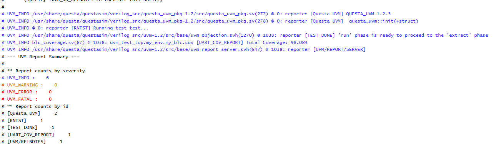
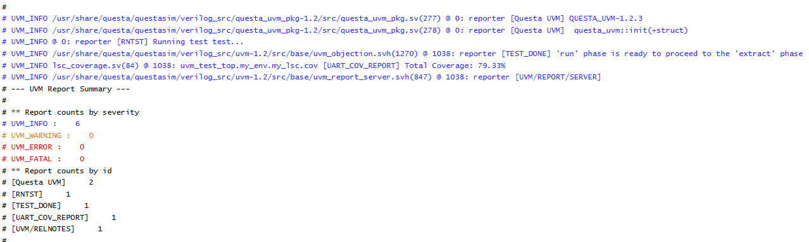
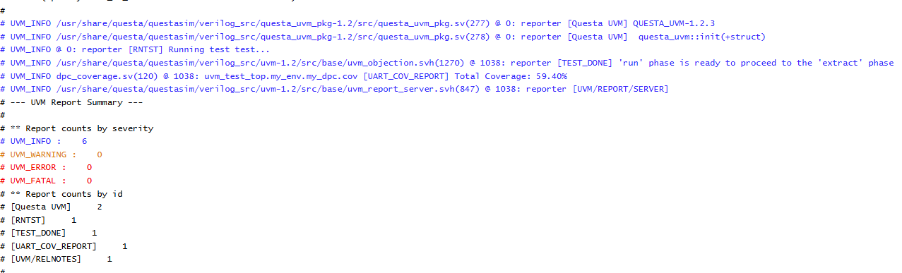
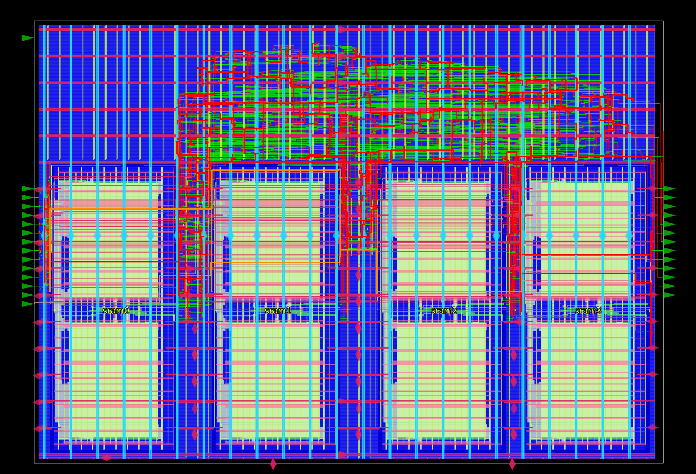
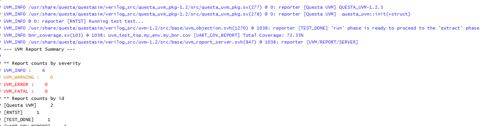
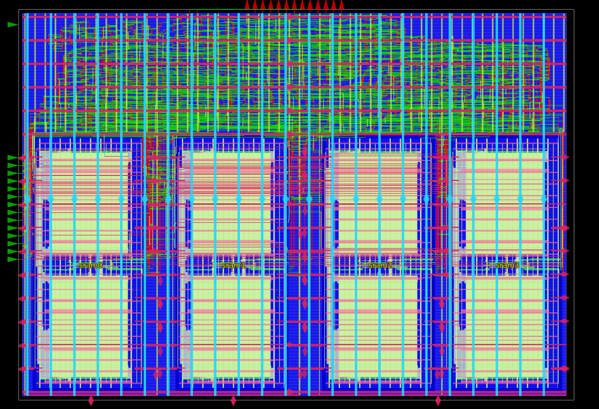
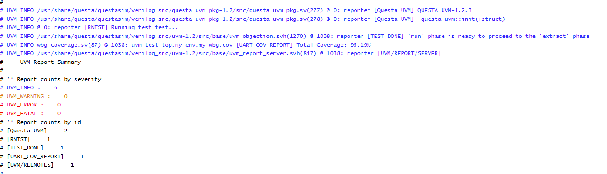
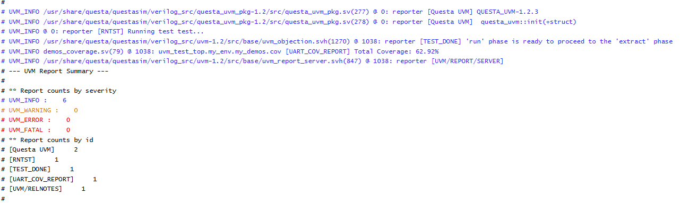
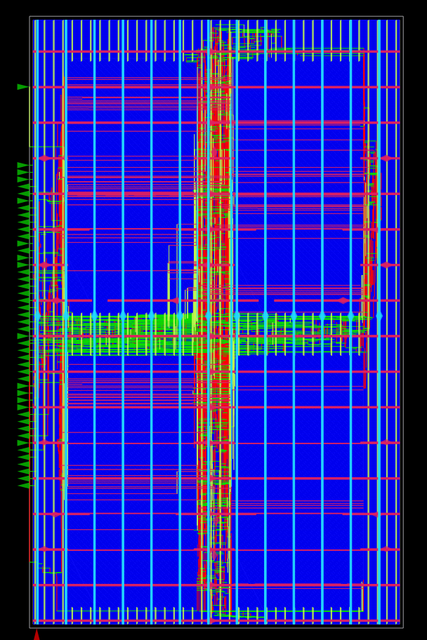

# Useful Refences
https://learnvisualcomputing.github.io/imaging-isp.html

https://cs.stanford.edu/~zdevito/a144-hegarty.pdf

https://docs.espressif.com/projects/esp-idf/en/stable/esp32p4/api-reference/peripherals/isp.html

https://www.xilinx.com/publications/user-guide/isp-user-guide.pdf

https://10xengineers.ai/exploring-the-world-of-infinite-isp-a-guide-to-infinite-possibilities/

# FIFO Buffer

## Overview
The FIFO module serves as a synchronized buffer for the 10-bit pixel data coming off the token bus. Because this logic will be integrated directly into the top-level module of the ISP chip, standard physical implementation steps (Synthesis, PnR, and GLS) are bypassed at this individual module level.

## Architecture & Hardware Design

### Synchronous FIFO (`fifo.v`)
This module is a parameterized synchronous FIFO, sized by default to a data width of 10 (`DATA_W = 10`) and a depth of 8 (`FIFO_D = 8`). 
* **Memory Inference:** Given the shallow depth, the memory is inferred as a simple register array rather than a hardened memory macro.

* **Pointer Management:** The design utilizes a standard binary read/write pointer scheme. An extra MSB guard bit is implemented to easily distinguish between `FULL` and `EMPTY` states without requiring gray-code conversion. This is perfectly safe as both pointers operate on the same clock domain without CDC concerns.

* **Stall-Free Operation:** Reads and writes are internally gated by `!EMPTY` and `!FULL` conditions. Back-to-back invalid operations are safely ignored, eliminating the need for complex external stall logic.

## Verification Environment
Validation for the FIFO bypasses a heavy UVM environment, as the required operational states are relatively simple. A basic static testbench was utilized to successfully verify:
* Read/Write operations on an empty buffer.
* Read/Write operations on a full buffer.
* Intermediate concurrent read and write operations.

# Black Level Correction (BLC)

## Overview
The Black Level Correction (BLC) stage is responsible for removing the camera sensor's innate black level offset and rescaling the resulting pixel values back to the full dynamic range. The correction follows the mathematical relationship: `(pixel - offset) * (2^n) / (sat_level - offset)`. 

Because the sensor offset and headroom differ across the Bayer filter color channels, the module dynamically tracks the row and column toggle (driven by `h_sync` and `v_sync`) to identify the currently active channel (R, Gr, Gb, or B).

## Architecture & Hardware Design

### BLC Pipeline (`BLC.v`)
The module processes the pixel stream through a highly optimized, 2-stage deep pipeline (`DELAY = 2`) that aligns the offset subtraction, multiplication, and clamping stages with the passing `valid`, `h_sync`, and `v_sync` control signals.
* **Elaboration-Time Scaling:** To avoid costly runtime hardware dividers, the scaling factors for each channel are precomputed at elaboration time. These are mapped as local parameters using a 16-bit fixed-point representation (`FRAC_BITS = 16`).

* **Dynamic Channel Muxing:** The active channel's specific `OFFSET_*` and precomputed `SCALE_FACTOR_*` are cleanly multiplexed into the datapath based on the real-time row/col position.

* **Safe Clamping Logic:** * **Underflow:** If a pixel value falls below the channel's specific black level during subtraction, the output is strictly clamped to `0`.
    * **Overflow:** If the rescaled value exceeds the maximum pixel range (`MAX_VAL`), it is clamped to full scale. This ensures the output never wraps, maintaining image integrity regardless of incoming black level noise.

### UVM
The design is validated within a UVM environment using purely randomized sequences of pixel streams and stalling behaviors to accurately replicate real-world camera sensor data. 

**EDA Playground Link:** [Launch UVM Simulation](https://edaplayground.com/x/7cP_)

* **Functional Coverage:** The environment utilizes a dedicated subscriber (`blc_coverage.sv`) to ensure robust test stimulus.It verifies that all four Bayer color channels (R, Gr, Gb, B) are fully exercised via row and column phase cross-coverage. It also ensures the full range of 10-bit input and output pixel values are generated , alongside comprehensive checking of control signal permutations (`h_sync`, `v_sync`, and `valid`).

* **Predictive Scoreboard:** The scoreboard (`scoreboard.sv`) implements an expected queue model (`exp_que`). When the monitor samples a valid input signal, the scoreboard independently calculates the expected output—applying the correct offset and scaling math based on the active color channel—and pushes it to the queue. Upon receiving a valid output from the DUT, the expected value is popped and directly compared against the actual `pixel_out`, flagging a `UVM_ERROR` upon any mismatch.

# Lens Shading Correction (LSC)

## Overview
The Lens Shading Correction (LSC) module compensates for the optical vignetting inherent to camera lenses, where image brightness naturally falls off towards the corners. The module applies a spatially-dependent digital gain to the incoming pixel stream, effectively brightening the periphery to achieve uniform illumination. 

The correction relies on a simplified radial polynomial equation: `pixel_out = pixel_in * Gain`. 
The `Gain` is calculated as `1 + c2 * R^2`, where `R^2` is the squared distance from the optical center (`dx^2 + dy^2`). The architecture assumes a standard RGGB raw Bayer pattern, allowing for distinct spatial correction coefficients (`c2`) for each color channel.

## Architecture & Hardware Design

### Spatial Pipelining (`LSC.v`)
To meet timing requirements while performing complex spatial mathematics, the module is constructed as a 6-stage deep pipeline (`DELAY = 6`). 

* **Coordinate Tracking:** The module actively tracks the current `x_count` and `y_count` of the incoming pixel stream, resetting upon `v_sync` and incrementing through the frame dimensions. 

* **Fixed-Point Datapath:** To avoid floating-point operations in hardware, the module utilizes a 24-bit fractional shift (`FP_SHIFT = 24`). It calculates the absolute distance from the frame center (`MID_X`, `MID_Y`), squares the results, and applies the channel-specific coefficient to calculate the required gain.

* **Overflow Protection:** After multiplying the input pixel by the computed spatial gain, the shifted result is aggressively clamped. If the brightened pixel exceeds the 10-bit maximum, it is locked to `MAX_VAL` to prevent numerical wrapping artifacts.

## UVM Verification Environment
The LSC module is rigorously validated using the established UVM environment, focusing on spatial accuracy and boundary conditions.

**EDA Playground Link:** [Launch UVM Simulation](https://edaplayground.com/x/FgsN)

* **Functional Coverage:** The `lsc_coverage` subscriber confirms that the internal tracking logic successfully sweeps across the entire target frame. It maps cross-coverage for X and Y coordinates to guarantee all quadrants of the image are stimulated, alongside standard signal toggling and full 10-bit data range utilization.

* **Predictive Scoreboard:** The scoreboard actively recalculates the required spatial math in SystemVerilog to verify the RTL. Upon sampling a valid input, the scoreboard independently derives `dx`, `dy`, and `R^2`, applies the corresponding 24-bit fixed-point math, and pushes the clamped expected result into a queue (`exp_que`). When the DUT asserts `valid_out`, this queue is popped and compared to ensure strict mathematical accuracy.

# Defective Pixel Correction (DPC)

## Overview
The Defective Pixel Correction (DPC) module is designed to identify and repair "hot" or "dead" pixels generated by sensor anomalies. It achieves this by employing a 5x5 sliding window algorithm to evaluate the 8 nearest neighboring pixels of the same color channel. If the center pixel deviates beyond a defined `THRESHOLD` compared to its neighbors, it is replaced by their average value. The module is designed with a 2-row blanking awareness and only corrects internal cells, leaving the extreme outer edges unmodified.

## Architecture & Hardware Design

### Memory and Buffering (`DPC.v`)
To facilitate a 5x5 spatial window, the module requires access to multiple rows of video simultaneously. 
**SRAM Line Buffers:** The top-level module instantiates four distinct 10x2048 SRAM blocks (`sram0` through `sram3`). These act as FIFO line buffers, cascading the incoming pixel stream to construct the vertical depth needed for the algorithm.

### Correction Core (`DPC_CORE.v`)
The core processing logic handles the mathematical defect detection and substitution.
**Spatial Tracking:** The core actively tracks the X and Y coordinates to determine if the current pixel is on a frame edge (`is_edge`) or if it is a green channel pixel (`is_green`) based on the Bayer pattern.

* **Min/Max Detection:** It continuously calculates the maximum (`neigh_max1`) and minimum (`neigh_min1`) values among the 8 surrounding neighbors.

* **Defect Substitution:** A pixel is flagged as `is_hot` if it is greater than the neighbor maximum by the `THRESHOLD`. It is flagged as `is_dead` if it is less than the neighbor minimum by the `THRESHOLD`. Defective pixels are immediately replaced by the local neighborhood average (`neigh_total`); otherwise, the original pixel is passed through.

## UVM Verification Environment
The DPC logic is thoroughly verified to ensure edge cases in the image boundary and varying color channels do not break the 5x5 spatial mapping.

**EDA Playground Link:** [Launch UVM Simulation](https://edaplayground.com/x/Eqfs)

* **Functional Coverage:** The `dpc_coverage` subscriber targets explicit cross-coverage scenarios. It ensures that hot and dead pixel conditions are verified against both Green and non-Green (Red/Blue) channels.It also guarantees these defect corrections are tested at the frame edges (`is_edge`) versus the center.

* **Predictive Scoreboard:** The scoreboard builds a 2D reference image (`ref_image`) in memory as data flows in. It implements the expected DPC logic in software, dynamically adjusting which 8 neighbors to sample based on whether the current coordinate aligns with a green pixel in the Bayer pattern. It calculates the threshold math independently and compares the resulting expected value against the DUT's `pixel_out`, flagging a `UVM_ERROR` upon any discrepancy.

## Logic Synthesis & Static Timing Analysis (STA)
Logic synthesis and static timing analysis (STA) were executed using Yosys and OpenSTA across three distinct operating corners: `slow` (worst-case), `typ`, and `fast`. The target technology mapping utilized the nanGate45 standard cell library alongside custom 10x2048 SRAM macro libraries. The synthesis targeted a strict 3ns clock period (333.33 MHz).

* **Capacitance & Slew Violations:** During the synthesis phase, the ABC optimization pass failed to properly buffer several high-fanout nets. OpenSTA flagged these as severe maximum capacitance (`max_capacitance`) violations, which consequently cascaded into maximum slew (`max_slew`) failures.

* **Worst-Case Timing:** As a direct result of the high capacitance and degraded slew on these unbuffered nets, the static timing analysis reported setup failures under the `slow` worst-case corner. 

* **Waiver & Resolution:** Because Yosys relies on ideal clock networks and basic wire load assumptions, these synthesis-stage violations were waived. The physical design (PNR) tool's superior CTS (Clock Tree Synthesis) and routing engines successfully rebuilt the data paths, buffered the high-fanout nets, and resolved all capacitance, slew, and setup/hold timing issues for final sign-off.

## Physical Design (PNR)
The physical implementation flow was executed using OpenROAD, advancing the synthesized netlist through floorplanning, placement, clock tree synthesis (CTS), and detailed routing. The final layout targets a fixed die size of 1050µm × 1720µm utilizing the nanGate45 Open Cell Library and four custom OpenRAM SRAM macro configurations.

* **Floorplanning & Power Distribution:** The design incorporates an extensive power distribution network (PDN) utilizing `metal1` for standard cell rows, `metal4` for intermediate horizontal stripes, and wide `metal5`/`metal6` grids for low-impedance vertical infrastructure. Custom SRAM halos and grid mappings were applied to ensure clean power delivery to the memory blocks.

* **Placement & Congestion Control:** To prevent cell crowding around the memory interfaces and routing bottlenecks during detailed routing, cell placement padding was globally constrained using `set_placement_padding -global -left 5 -right 5`. Small, low-drive buffer and inverter variants (`*BUF_X1`, `*BUF_X2`, `*INV_X1`, `*INV_X2`) were set as `dont_use` to force the tool to instantiate robust, transition-resilient logic across long interconnects.

* **Clock Tree Synthesis (CTS):** Clock networks were synthesized using a specific buffer target list bounded to high-drive variants (`CLKBUF_X3`). Implementing propagated clocking and automatic net repairs effectively resolved the severe setup failures and maximum capacitance/slew violations carried over from the logic synthesis phase.

* **Routing & Sign-off:** Signal routing was constrained to layers `metal2` through `metal6`, leaving `metal1` dedicated exclusively to cell local connections, while clock trees were assigned to higher-speed `metal3` through `metal6` layers. Antenna violations were automatically checked and mitigated via intermediate diode insertion (`repair_antennas`). 

* **Physical & Electrical Metrics:** The completed layout achieved full sign-off closure with **0 DRC, 0 LVS, and 0 ERC errors**. 
  * **Area Utilization:** `75%` target core density across the 1050µm × 1720µm die boundary.
  * **Timing Sign-off:** Successfully closed timing with a positive setup slack margin of `0.31ns`.
  * **Power Consumption:** Total power consumption closed at `6.17mW` (`6.17e-03 Watts`), with an electrical distribution profile of `46%` internal power, `51%` dynamic switching power, and a well-controlled `3%` static leakage component.

# Bayer Noise Reduction (BNR)

## Overview
The Bayer Noise Reduction (BNR) module filters out high-frequency noise inherent to camera sensors by utilizing a 5x5 sliding window. It calculates a normalized, weighted average of neighboring pixels by evaluating both their spatial proximity and their intensity difference (range) relative to the center pixel. The algorithm selectively smooths areas of uniform color while preserving sharp edges.

## Architecture & Hardware Design

### Memory Buffering (`BNR.v`)
To support the complex 5x5 spatial window, the module requires concurrent access to multiple video lines. 
**SRAM Line Buffers:** The architecture integrates four separate 10x2048 SRAM macros (`sram0` through `sram3`). These act as cascading FIFO buffers to retain the necessary historical row data as the pixel stream flows in.

### Processing Core (`BNR_CORE.v` & `RANGE_LUT.v`)
To meet strict timing budgets while calculating multi-variable weighted averages, the mathematical core is aggressively pipelined across 10 stages (`DELAY = 10`).

* **Bayer-Aware Spatial Weighting:** The module evaluates the X/Y coordinates to determine if the center pixel lies on a Green channel or a Red/Blue channel (`is_green`). It then dynamically applies the correct spatial weight distribution to match the underlying Bayer filter pattern.

* **Range LUT:** Absolute intensity differences between the center and neighboring pixels are fed into a Look-Up Table (`RANGE_LUT.v`). Smaller differences receive higher weights (e.g., a difference <= 15 yields a weight of 4), ensuring that only visually similar pixels contribute heavily to the noise reduction.

* **ROM-Based Normalization:** To divide the final accumulated value by the sum of all applied weights, the design avoids instantiating an expensive hardware divider. Instead, it utilizes a reciprocal ROM containing pre-computed values (`1024 / r`). The final normalization is efficiently executed as a multiplication against the reciprocal, followed by a 10-bit right shift.

* **Edge Bypass:** Pixels residing on the extreme outer boundary of the frame (`is_edge`) bypass the filtering logic and are output unmodified.

## UVM Verification Environment
The BNR module's complex weighting math and boundary conditions are rigorously tested using a UVM framework.

**EDA Playground Link:** [Launch UVM Simulation](https://edaplayground.com/x/9pNZ)

* **Functional Coverage:** The `bnr_coverage` subscriber maps the full 10-bit input/output pixel range. It tracks memory coordinates to ensure the entire frame is swept and verifies cross-coverage for critical edge conditions (`is_edge`) and color channel variations (`is_green`).

* **Predictive Scoreboard:** The scoreboard models the complete algorithm in SystemVerilog. It builds a 2D reference image in memory and independently computes the expected range weights, spatial mapping, and reciprocal normalization. This expected value is then rigorously compared against the DUT's `pixel_out`, throwing a `UVM_ERROR` upon any mismatch.

## Logic Synthesis & Static Timing Analysis (STA)
Logic synthesis and static timing analysis (STA) for the BNR module were executed using Yosys and OpenSTA across three distinct operating corners: `slow` (worst-case), `typ`, and `fast`. The target technology mapping utilized the nanGate45 standard cell library alongside custom 10x2048 SRAM macro libraries. The synthesis targeted a strict 3ns clock period (333.33 MHz) via ABC constraints.

* **Capacitance & Slew Violations:** Similar to the DPC module, during the synthesis phase, the optimization pass failed to properly buffer several high-fanout nets. OpenSTA flagged these as severe maximum capacitance (`max_capacitance`) violations, which consequently cascaded into maximum slew (`max_slew`) failures.
* **Worst-Case Timing:** As a direct result of the high capacitance and degraded slew on these unbuffered nets, the static timing analysis reported setup failures under the `slow` worst-case corner. 
* **Waiver & Resolution:** Because Yosys relies on ideal clock networks and basic wire load assumptions, these synthesis-stage violations were waived. The physical design (PNR) tool's superior CTS (Clock Tree Synthesis) and routing engines successfully rebuilt the data paths, buffered the high-fanout nets, and resolved all capacitance, slew, and setup timing issues for final sign-off.

## Physical Design (PNR)
The physical implementation flow was executed using OpenROAD, advancing the synthesized netlist through floorplanning, placement, clock tree synthesis (CTS), and detailed routing. The final layout targets a fixed die size of 1150µm × 1820µm utilizing the nanGate45 standard cell library and four custom OpenRAM SRAM macro configurations.

* **Floorplanning & Power Distribution:** The design incorporates an extensive power distribution network (PDN) utilizing `metal1` for standard cell rows, `metal4` for intermediate horizontal stripes, and wide `metal5`/`metal6` grids for low-impedance vertical infrastructure. Custom SRAM halos (`-halo {1 1 1 1}`) and grid mappings were applied to ensure clean power delivery to the memory blocks.

* **Placement & Congestion Control:** To prevent cell crowding around the memory interfaces and routing bottlenecks during detailed routing, cell placement padding was globally constrained using `set_placement_padding -global -left 5 -right 5`. 

* **Clock Tree Synthesis (CTS):** Clock networks were synthesized using a specific buffer target list bounded to high-drive variants (`CLKBUF_X3`). Implementing propagated clocking and automatic net repairs effectively resolved the severe setup failures and maximum capacitance/slew violations carried over from the logic synthesis phase.

* **Routing & Sign-off:** Signal routing was constrained to layers `metal2` through `metal6`, leaving `metal1` dedicated exclusively to cell local connections. Clock trees were assigned to higher-speed `metal3` through `metal6` layers. Antenna violations were automatically checked and mitigated via intermediate diode insertion (`repair_antennas`). 

* **Physical & Electrical Metrics:** The completed layout achieved full sign-off closure, successfully clearing the setup and design rule violations from synthesis to yield a timing-clean, fully routed module ready for top-level integration.
  * **Area Utilization:** Achieved `68%` target core density across the 1100µm × 1800µm die boundary.
  * **Timing Sign-off:** Successfully closed timing with a positive setup slack margin of `0.25ns`.
  * **Power Consumption:** Total power consumption closed at `6.93mW`, with an electrical distribution profile of `50%` internal power, `46%` dynamic switching power, and a well-controlled `4%` static leakage component.

# White Balance Gain (WBG)

## Overview
The White Balance Gain (WBG) stage adjusts the relative color intensities of the Bayer filter grid to ensure that neutral colors are accurately reproduced under varying ambient lighting conditions. By applying independent, digital gains to each specific color channel (R, Gr, Gb, and B), the module compensates for illumination imbalances introduced by the capture environment or inherent camera sensor sensitivities. 

The correction relies on a fixed-point multiplication datapath: `pixel_out = (pixel_in * GAIN) >> FRAC_BITS`. The active gain configuration is dynamically multiplexed into the execution pipeline based on the real-time row and column synchronization state of the raw image stream.

## Architecture & Hardware Design

### WBG Pipeline (`WBG.v`)
The module streams pixel data through a highly synchronized, single-stage execution pipeline (`DELAY = 1`) that precisely aligns data transformations with passing control indicators.
* **Bayer Phase Tracking:** The architecture implements local monitoring registers (`row`, `col`) that track line and frame transitions by checking the `v_sync` and `h_sync` boundaries. This coordinate tracking uniquely identifies the current color channel phase for every incoming pixel.
* **Fixed-Point Gain Application:** The core computes scaling math using an 8-bit fractional shift parameter (`FRAC_BITS = 8`). Based on the determined Bayer quadrant, the incoming pixel is multiplied by corresponding programmable channel coefficients: `R_GAIN = 384`, `GR_GAIN = 256`, `GB_GAIN = 256`, or `B_GAIN = 512`.
* **Control Pipelining:** To guarantee timing closure under high frequency operation, control qualifiers (`valid_in`, `h_sync`, `v_sync`) are registered and advanced through parallel matching pipelines (`valid_pipe`, `h_pipe`, `v_pipe`) to emerge perfectly aligned with the processed pixel output.
* **Overflow Dynamic Clamping:** Following the fixed-point right-shift operation, the product is evaluated against a 10-bit maximum headroom limit (`MAX_VAL`). If the scaled pixel exceeds the top boundary, the output is bounded to full scale to avoid structural wrapping artifacts and protect image clarity.

## UVM Verification Environment
The mathematical accuracy and coordinate tracking logic of the WBG module are thoroughly validated using a comprehensive UVM testbench.

**EDA Playground Link:** [Launch UVM Simulation](https://edaplayground.com/x/Jc8Z)

* **Functional Coverage:** The `wbg_coverage` subscriber validates test suite stimulus via an internal covergroup configuration. It partitions the full 10-bit input and output data ranges into 10 distinct distribution bins to ensure complete dynamic range sweep. Additionally, it maps explicit cross-coverage across the even/odd variations of `row_phase` and `col_phase` to guarantee all four Bayer color domains (R, Gr, Gb, B) are fully exercised, alongside detailed testing of control signal combinations (`valid_out`, `h_sync_out`, `v_sync_out`).

* **Predictive Scoreboard:** The scoreboard component models the golden architectural specification in software using an internal storage array (`exp_que`). When valid input data is captured, the scoreboard independently decodes the current Bayer grid phase, matches the appropriate hardware multiplier coefficient, shifts the fixed-point value, and logs the clamped result. Output items arriving from the DUT are instantly popped and checked for bit-accurate numerical parity, automatically generating a `UVM_ERROR` upon any data mismatch or out-of-order execution error.

## Demosiac
**EDA Playground Link:** [Launch UVM Simulation](https://edaplayground.com/x/c7bt)

62% util .25ns setup slack, 0 hold slack, power (57% internal, 37 swithcing, and 6% leakage for ) 4.02 mW.

## CCM (Color Correction Matrix)

## Gamma Correction